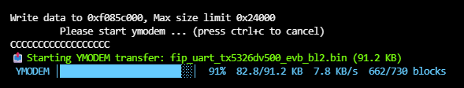

# tabby-XYZmodem

A [Tabby](https://github.com/Eugeny/tabby) plugin that adds **XMODEM** and **YMODEM** file transfer support directly in the terminal.

## Features

- 📤 Send files via **YMODEM** (CRC-16 mode, batch protocol)
- 📤 Send files via **XMODEM** (CRC-16 mode)
- 📊 **Real-time progress bar** in the terminal — percentage, speed (KB/s), block count
- 🔌 Works with serial port connections (and any other session type)
- 🛡️ Robust handshake with timeout/retry handling

## Screenshot



## Usage

1. Open a serial port tab in Tabby and connect to your device
2. Start YMODEM/XMODEM receive on your device (e.g. `ymodem_recv`, `rz`, or a bootloader prompt)
3. **Right-click** anywhere in the terminal
4. Choose **Send file (YMODEM)** or **Send file (XMODEM)**
5. Select your file — transfer starts immediately

During the transfer, you will see a live progress line in the terminal:

```
📤 Starting YMODEM transfer: firmware.bin (91.2 KB)
 YMODEM │████████████░░░░░░░░░░░░│  52%  47.3/91.2 KB  3.2 KB/s  380/730 blocks
✅ YMODEM transfer complete: firmware.bin
```

## Installation

### From Tabby Plugin Manager (recommended)

Search for `tabby-XYZmodem` in Tabby's Plugin Manager.

### Manual

```bash
cd %APPDATA%\tabby\plugins
npm install tabby-xyzmodem
```

Or clone this repo and symlink it:

```bash
git clone git@github.com:lijzijie/tabby-XYZmodem.git
cd %APPDATA%\tabby\plugins\node_modules
# Windows (run as Administrator)
mklink /D tabby-xyzmodem C:\path\to\tabby-XYZmodem
```

Then restart Tabby.

## Development

```bash
git clone git@github.com:lijzijie/tabby-XYZmodem.git
cd tabby-XYZmodem
npm install
npm run build       # one-time build
npm run build --watch  # watch mode
```

## Protocol Implementation

The XMODEM/YMODEM protocol is implemented from scratch in [`src/protocol.ts`](src/protocol.ts) without relying on third-party modem libraries. Key details:

- **CRC-16/CCITT** checksum (triggered by receiver sending `C`)
- **YMODEM Block 0** — filename + file size header
- **YMODEM end-of-session** — null header block (all 0x00) to signal no more files
- **Retry on NAK** — up to 5 retries per block
- **Proper EOT sequence** — first EOT → NAK → second EOT → ACK → C → null block

## License

MIT
